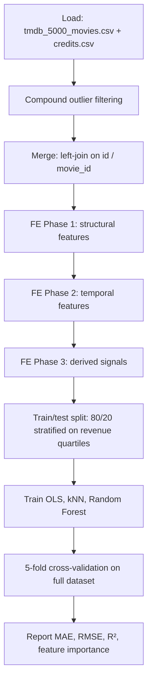
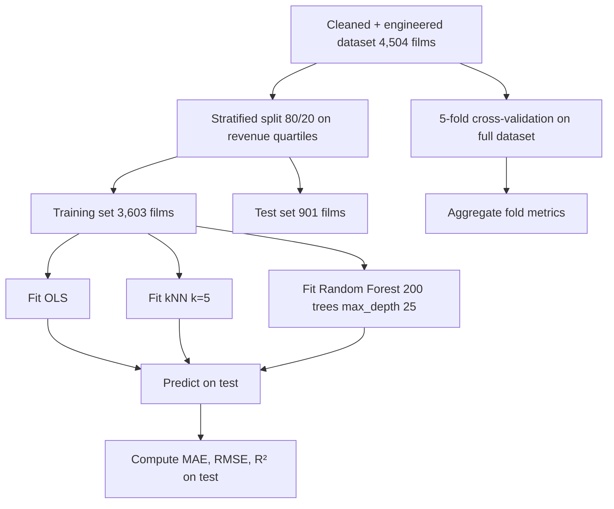

# Architecture

Technical reference for the movie revenue prediction pipeline. The README covers the dataset, models, and high-level results; this doc focuses on the engineering structure and feature-construction reasoning.

## Pipeline overview



Each stage is a logical block in `scripts/feature_engineering_and_modeling.py` and a corresponding notebook cell in `notebooks/movie_revenue_prediction.ipynb`.

## Stage 1: outlier filtering

Compound thresholds remove films with atypical economics:

| Filter | Reason |
|--------|--------|
| `budget ≤ 175M` | Removes blockbusters with very different distribution dynamics |
| `revenue ≤ 700M` | Removes mega-hits whose revenue is driven by factors outside metadata |
| `vote_count ≤ 8000` | Removes films with extreme audience attention (often franchise tentpoles) |
| `3.5 ≤ vote_average ≤ 8.3` | Removes films with too few votes (extreme averages) |
| `60 ≤ runtime ≤ 200` | Removes shorts (festival entries) and epics |
| `popularity ≤ 150` | Removes outliers in TMDB's popularity score |

Applies in series. Result: 4,803 films → 4,504 films (299 removed, ~6%).

## Stage 2: structural feature engineering

| Feature group | Source | Construction |
|---------------|--------|--------------|
| Genres | `genres` JSON | Parsed via `ast.literal_eval`, one-hot encoded (Action, Adventure, Comedy, ...) |
| Cast | `cast` JSON in credits | Parsed, top 10 actors per film, mapped to "famous actor" flag (≥5 high-impact films) |
| Crew | `crew` JSON in credits | Parsed for director, writer; mapped to "famous director" flag |
| Production company | `production_companies` JSON | Parsed; major-studio flags + per-studio mean revenue |
| Collection | `belongs_to_collection` JSON | Parsed for franchise membership; per-collection mean revenue |
| Budget bucket | `budget` | Discretized into bands |
| Runtime bucket | `runtime` | Discretized into bands |

The "famous" flags are the unusual choice. Raw counts of cast or crew are not predictive because every film has the same number of slots. The threshold of "≥5 high-impact films" creates a binary that captures A-list status more accurately.

## Stage 3: temporal feature engineering

| Feature | Construction |
|---------|--------------|
| Release month (one-hot) | 12 binary columns from `release_date` |
| Five-year period bin | 1980-1984, 1985-1989, ..., 2015-2019, 2020+ |
| Holiday flag | True if release in late November or December |
| Summer flag | True if release in May-August |
| Spring break flag | True if release in March-April |
| Day of week | One-hot from `release_date` weekday |

Movies released in different windows have different revenue dynamics. A summer blockbuster grosses differently than a January release of the same film.

## Stage 4: derived signals

| Feature | Construction |
|---------|--------------|
| Director historical revenue | Per-director mean revenue across all films in dataset |
| Studio historical revenue | Per-studio mean revenue (max across studios for multi-studio films) |
| Franchise historical revenue | Per-collection mean revenue (0 if not a franchise) |
| Famous actor count | Number of cast members flagged as "famous" |
| `log1p(budget)` | Log-transform of budget |
| `log1p(popularity)` | Log-transform of popularity |
| `budget × popularity` | Multiplicative interaction |
| `franchise × budget` | Multiplicative interaction |
| `director_revenue × budget` | Multiplicative interaction |
| 9 more interaction terms | Various multiplicative combinations |

The interaction terms capture effect modulation. Pure linear models treat features as independent: budget contributes X, franchise contributes Y, total is X+Y. In reality, a big budget on a franchise film grosses much more than the sum of the two effects alone. Interaction terms encode this.

## Stage 5: model training



Three models, each chosen to test a different hypothesis:

- **OLS (linear)**: baseline. If the world is approximately linear in our features, OLS captures it.
- **kNN**: instance-based. Predicts by averaging the revenue of the 5 most similar films. Tests whether similarity-based prediction works.
- **Random Forest**: ensemble. Captures nonlinear interactions and feature importance.

## Stage 6: evaluation

| Model | MAE (millions USD) | RMSE | R² |
|-------|-------------------|------|-----|
| OLS | 36.1M | 56.6M | 0.769 |
| kNN (k=5) | 41.3M | 73.3M | 0.613 |
| Random Forest | 31.4M | 58.7M | 0.752 |

Random Forest wins on MAE while keeping R² competitive with OLS. kNN suffers from the curse of dimensionality (~100 features); pairwise distance loses meaning at this dimensionality.

## Feature importance

Random Forest provides feature importance scores. Top features (typical run):

1. Budget
2. Popularity
3. Franchise indicator
4. Studio average revenue
5. Vote count
6. Director average revenue
7. Runtime
8. Release year
9. Various interaction terms

Aligns with domain intuition: the variables an industry analyst would point to first are also what the model uses.

## Cross-validation

5-fold repeated cross-validation on the full cleaned dataset. Each fold:

1. Split into 80% train / 20% validation.
2. Fit model on train.
3. Predict on validation.
4. Compute MAE, RMSE, R².

Repeat 5 times, average the metrics. The aggregate gives a stable generalization estimate.

## Reproducibility

The notebook (`notebooks/movie_revenue_prediction.ipynb`) is the canonical workflow. The script (`scripts/feature_engineering_and_modeling.py`) is a Python file with the same logic, runnable end-to-end:

```bash
pip install -r requirements.txt
python scripts/feature_engineering_and_modeling.py
```

Every result in the report is reproduced by the script. Random seeds are fixed for deterministic output.

## Output artifacts

- `report/movie_revenue_prediction_report.pdf`: full writeup with results and analysis.
- Console output: MAE, RMSE, R² per model.
- Feature importance plot: bar chart of Random Forest importances.
- Residual analysis: scatter of predicted vs actual revenue.

## Dependencies

| Package | Version | Use |
|---------|---------|-----|
| pandas | 2.2+ | DataFrame manipulation |
| numpy | 2.0+ | Numerical operations |
| scikit-learn | 1.5+ | Models (OLS, kNN, Random Forest), CV, metrics |
| matplotlib | 3.9+ | Plots |
| jupyter | latest | Notebook execution |

Install via `pip install -r requirements.txt`.
